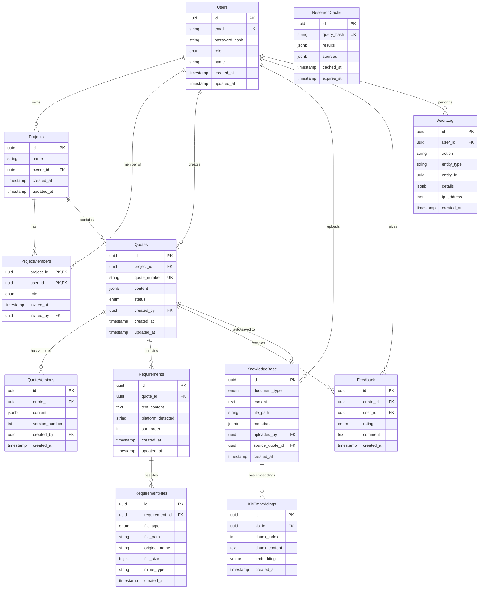

# Database Schema Specification

## AI-Based Quote Generation Assistant

**Database**: PostgreSQL 15+
**Extensions Required**: pgvector, uuid-ossp, pg_trgm
**Last Updated**: 2026-01-20
**Version**: 1.0.0

---

## Table of Contents

1. [Entity Relationship Diagram](#entity-relationship-diagram)
2. [Schema Overview](#schema-overview)
3. [Table Definitions](#table-definitions)
4. [Indexes](#indexes)
5. [Foreign Key Relationships](#foreign-key-relationships)
6. [Audit Logging Strategy](#audit-logging-strategy)
7. [Data Retention Policies](#data-retention-policies)
8. [Migration Strategy](#migration-strategy)
9. [Vector Store Schema (RAG)](#vector-store-schema-rag)
10. [Sequences and Auto-Generation](#sequences-and-auto-generation)

---

## Entity Relationship Diagram



### ASCII Diagram (Alternative View)

```
+-------------+       +------------------+       +-------------+
|   Users     |------>|  ProjectMembers  |<------|   Projects  |
+-------------+       +------------------+       +-------------+
      |                                                |
      |                                                |
      v                                                v
+-------------+       +------------------+       +-------------+
|   Quotes    |------>|  QuoteVersions   |       | Requirements|
+-------------+       +------------------+       +-------------+
      |                                                |
      |                                                v
      v                                         +------------------+
+-------------+       +------------------+      | RequirementFiles |
|  Feedback   |       | KnowledgeBase    |      +------------------+
+-------------+       +------------------+
                             |
                             v
                      +------------------+
                      |  KBEmbeddings    |
                      +------------------+

+-------------+       +------------------+
| AuditLog    |       | ResearchCache    |
+-------------+       +------------------+
```

---

## Schema Overview

### Database Extensions

```sql
-- Required extensions
CREATE EXTENSION IF NOT EXISTS "uuid-ossp";      -- UUID generation
CREATE EXTENSION IF NOT EXISTS "pgvector";       -- Vector embeddings for RAG
CREATE EXTENSION IF NOT EXISTS "pg_trgm";        -- Trigram matching for fuzzy search
```

### Custom Types (Enums)

```sql
-- User roles
CREATE TYPE user_role AS ENUM ('admin', 'pm');

-- Project member roles
CREATE TYPE project_member_role AS ENUM ('owner', 'editor', 'viewer');

-- Quote status
CREATE TYPE quote_status AS ENUM (
    'draft',
    'in_review',
    'approved',
    'sent',
    'accepted',
    'rejected',
    'archived'
);

-- Feedback rating
CREATE TYPE feedback_rating AS ENUM ('up', 'down');

-- File types for requirement files
CREATE TYPE requirement_file_type AS ENUM ('image', 'document');

-- Knowledge base document types
CREATE TYPE kb_document_type AS ENUM ('quote', 'requirement', 'template', 'reference');
```

---

## Table Definitions

### 1. Users

Stores all system users with authentication and role information.

```sql
CREATE TABLE users (
    id              UUID PRIMARY KEY DEFAULT uuid_generate_v4(),
    email           VARCHAR(255) NOT NULL,
    password_hash   VARCHAR(255) NOT NULL,
    role            user_role NOT NULL DEFAULT 'pm',
    name            VARCHAR(255) NOT NULL,
    is_active       BOOLEAN NOT NULL DEFAULT TRUE,
    last_login_at   TIMESTAMP WITH TIME ZONE,
    created_at      TIMESTAMP WITH TIME ZONE NOT NULL DEFAULT CURRENT_TIMESTAMP,
    updated_at      TIMESTAMP WITH TIME ZONE NOT NULL DEFAULT CURRENT_TIMESTAMP,

    CONSTRAINT users_email_unique UNIQUE (email),
    CONSTRAINT users_email_format CHECK (email ~* '^[A-Za-z0-9._%+-]+@[A-Za-z0-9.-]+\.[A-Za-z]{2,}$')
);

COMMENT ON TABLE users IS 'System users including admins and project managers';
COMMENT ON COLUMN users.password_hash IS 'Argon2id hashed password';
COMMENT ON COLUMN users.role IS 'admin: full system access, pm: project management access';
```

### 2. Projects

Container for organizing quotes and team collaboration.

```sql
CREATE TABLE projects (
    id              UUID PRIMARY KEY DEFAULT uuid_generate_v4(),
    name            VARCHAR(255) NOT NULL,
    description     TEXT,
    owner_id        UUID NOT NULL,
    is_archived     BOOLEAN NOT NULL DEFAULT FALSE,
    created_at      TIMESTAMP WITH TIME ZONE NOT NULL DEFAULT CURRENT_TIMESTAMP,
    updated_at      TIMESTAMP WITH TIME ZONE NOT NULL DEFAULT CURRENT_TIMESTAMP,

    CONSTRAINT projects_owner_fk FOREIGN KEY (owner_id)
        REFERENCES users(id) ON DELETE RESTRICT,
    CONSTRAINT projects_name_not_empty CHECK (LENGTH(TRIM(name)) > 0)
);

COMMENT ON TABLE projects IS 'Project containers for organizing quotes';
```

### 3. ProjectMembers

Junction table for project collaboration with role-based access.

```sql
CREATE TABLE project_members (
    project_id      UUID NOT NULL,
    user_id         UUID NOT NULL,
    role            project_member_role NOT NULL DEFAULT 'viewer',
    invited_at      TIMESTAMP WITH TIME ZONE NOT NULL DEFAULT CURRENT_TIMESTAMP,
    invited_by      UUID,

    CONSTRAINT project_members_pk PRIMARY KEY (project_id, user_id),
    CONSTRAINT project_members_project_fk FOREIGN KEY (project_id)
        REFERENCES projects(id) ON DELETE CASCADE,
    CONSTRAINT project_members_user_fk FOREIGN KEY (user_id)
        REFERENCES users(id) ON DELETE CASCADE,
    CONSTRAINT project_members_invited_by_fk FOREIGN KEY (invited_by)
        REFERENCES users(id) ON DELETE SET NULL
);

COMMENT ON TABLE project_members IS 'Project membership and roles for collaboration';
```

### 4. QuoteSequence (Supporting Table)

Manages yearly quote number sequences.

```sql
CREATE TABLE quote_sequences (
    year            INTEGER PRIMARY KEY,
    last_number     INTEGER NOT NULL DEFAULT 0,

    CONSTRAINT quote_sequences_year_valid CHECK (year >= 2024 AND year <= 2100),
    CONSTRAINT quote_sequences_number_positive CHECK (last_number >= 0)
);

COMMENT ON TABLE quote_sequences IS 'Tracks sequential quote numbers per year for QUOTE-YYYY-NNN format';
```

### 5. Quotes

Main quote entity with versioned content and status tracking.

```sql
CREATE TABLE quotes (
    id              UUID PRIMARY KEY DEFAULT uuid_generate_v4(),
    project_id      UUID NOT NULL,
    quote_number    VARCHAR(20) NOT NULL,
    title           VARCHAR(255) NOT NULL,
    content         JSONB NOT NULL DEFAULT '{}',
    status          quote_status NOT NULL DEFAULT 'draft',
    total_amount    DECIMAL(15, 2),
    currency        VARCHAR(3) DEFAULT 'USD',
    valid_until     DATE,
    created_by      UUID NOT NULL,
    locked_by       UUID,
    locked_at       TIMESTAMP WITH TIME ZONE,
    created_at      TIMESTAMP WITH TIME ZONE NOT NULL DEFAULT CURRENT_TIMESTAMP,
    updated_at      TIMESTAMP WITH TIME ZONE NOT NULL DEFAULT CURRENT_TIMESTAMP,

    CONSTRAINT quotes_project_fk FOREIGN KEY (project_id)
        REFERENCES projects(id) ON DELETE RESTRICT,
    CONSTRAINT quotes_created_by_fk FOREIGN KEY (created_by)
        REFERENCES users(id) ON DELETE RESTRICT,
    CONSTRAINT quotes_locked_by_fk FOREIGN KEY (locked_by)
        REFERENCES users(id) ON DELETE SET NULL,
    CONSTRAINT quotes_number_unique UNIQUE (quote_number),
    CONSTRAINT quotes_number_format CHECK (quote_number ~ '^QUOTE-[0-9]{4}-[0-9]{3,}$'),
    CONSTRAINT quotes_amount_positive CHECK (total_amount IS NULL OR total_amount >= 0)
);

COMMENT ON TABLE quotes IS 'Quote documents with AI-generated content';
COMMENT ON COLUMN quotes.quote_number IS 'Format: QUOTE-YYYY-NNN (e.g., QUOTE-2024-001)';
COMMENT ON COLUMN quotes.content IS 'JSONB structure containing quote sections, line items, terms';
COMMENT ON COLUMN quotes.locked_by IS 'User currently editing (for collaborative editing support)';
```

### 6. QuoteVersions

Immutable version history for quotes.

```sql
CREATE TABLE quote_versions (
    id              UUID PRIMARY KEY DEFAULT uuid_generate_v4(),
    quote_id        UUID NOT NULL,
    content         JSONB NOT NULL,
    version_number  INTEGER NOT NULL,
    change_summary  TEXT,
    created_by      UUID NOT NULL,
    created_at      TIMESTAMP WITH TIME ZONE NOT NULL DEFAULT CURRENT_TIMESTAMP,

    CONSTRAINT quote_versions_quote_fk FOREIGN KEY (quote_id)
        REFERENCES quotes(id) ON DELETE CASCADE,
    CONSTRAINT quote_versions_created_by_fk FOREIGN KEY (created_by)
        REFERENCES users(id) ON DELETE RESTRICT,
    CONSTRAINT quote_versions_unique UNIQUE (quote_id, version_number),
    CONSTRAINT quote_versions_number_positive CHECK (version_number > 0)
);

COMMENT ON TABLE quote_versions IS 'Immutable version history for quote content';
```

### 7. Requirements

Requirements extracted or entered for a quote.

```sql
CREATE TABLE requirements (
    id                  UUID PRIMARY KEY DEFAULT uuid_generate_v4(),
    quote_id            UUID NOT NULL,
    text_content        TEXT NOT NULL,
    platform_detected   VARCHAR(100),
    complexity_score    SMALLINT,
    estimated_hours     DECIMAL(8, 2),
    ai_analysis         JSONB,
    sort_order          INTEGER NOT NULL DEFAULT 0,
    created_at          TIMESTAMP WITH TIME ZONE NOT NULL DEFAULT CURRENT_TIMESTAMP,
    updated_at          TIMESTAMP WITH TIME ZONE NOT NULL DEFAULT CURRENT_TIMESTAMP,

    CONSTRAINT requirements_quote_fk FOREIGN KEY (quote_id)
        REFERENCES quotes(id) ON DELETE CASCADE,
    CONSTRAINT requirements_complexity_range CHECK (
        complexity_score IS NULL OR (complexity_score >= 1 AND complexity_score <= 10)
    ),
    CONSTRAINT requirements_hours_positive CHECK (
        estimated_hours IS NULL OR estimated_hours >= 0
    )
);

COMMENT ON TABLE requirements IS 'Individual requirements for quote estimation';
COMMENT ON COLUMN requirements.platform_detected IS 'Detected platform/technology (web, ios, android, etc.)';
COMMENT ON COLUMN requirements.ai_analysis IS 'AI-generated analysis including breakdown and suggestions';
```

### 8. RequirementFiles

File attachments for requirements (images, documents).

```sql
CREATE TABLE requirement_files (
    id              UUID PRIMARY KEY DEFAULT uuid_generate_v4(),
    requirement_id  UUID NOT NULL,
    file_type       requirement_file_type NOT NULL,
    file_path       VARCHAR(500) NOT NULL,
    original_name   VARCHAR(255) NOT NULL,
    file_size       BIGINT NOT NULL,
    mime_type       VARCHAR(100) NOT NULL,
    ocr_text        TEXT,
    ai_description  TEXT,
    created_at      TIMESTAMP WITH TIME ZONE NOT NULL DEFAULT CURRENT_TIMESTAMP,

    CONSTRAINT requirement_files_requirement_fk FOREIGN KEY (requirement_id)
        REFERENCES requirements(id) ON DELETE CASCADE,
    CONSTRAINT requirement_files_size_positive CHECK (file_size > 0),
    CONSTRAINT requirement_files_path_not_empty CHECK (LENGTH(TRIM(file_path)) > 0)
);

COMMENT ON TABLE requirement_files IS 'File attachments for requirements (images, documents)';
COMMENT ON COLUMN requirement_files.ocr_text IS 'Extracted text from image/document via OCR';
COMMENT ON COLUMN requirement_files.ai_description IS 'AI-generated description of visual content';
```

### 9. KnowledgeBase

Central repository for quotes, templates, and reference documents.

```sql
CREATE TABLE knowledge_base (
    id              UUID PRIMARY KEY DEFAULT uuid_generate_v4(),
    document_type   kb_document_type NOT NULL,
    title           VARCHAR(255) NOT NULL,
    content         TEXT,
    file_path       VARCHAR(500),
    metadata        JSONB DEFAULT '{}',
    uploaded_by     UUID,
    source_quote_id UUID,
    is_active       BOOLEAN NOT NULL DEFAULT TRUE,
    created_at      TIMESTAMP WITH TIME ZONE NOT NULL DEFAULT CURRENT_TIMESTAMP,
    updated_at      TIMESTAMP WITH TIME ZONE NOT NULL DEFAULT CURRENT_TIMESTAMP,

    CONSTRAINT knowledge_base_uploaded_by_fk FOREIGN KEY (uploaded_by)
        REFERENCES users(id) ON DELETE SET NULL,
    CONSTRAINT knowledge_base_source_quote_fk FOREIGN KEY (source_quote_id)
        REFERENCES quotes(id) ON DELETE SET NULL,
    CONSTRAINT knowledge_base_has_content CHECK (
        content IS NOT NULL OR file_path IS NOT NULL
    )
);

COMMENT ON TABLE knowledge_base IS 'Repository for RAG - quotes, templates, and reference documents';
COMMENT ON COLUMN knowledge_base.metadata IS 'Additional metadata: tags, categories, client info, etc.';
COMMENT ON COLUMN knowledge_base.source_quote_id IS 'Reference to quote if auto-saved from quote creation';
```

### 10. KBEmbeddings (Vector Store)

Vector embeddings for knowledge base content (RAG support).

```sql
CREATE TABLE kb_embeddings (
    id              UUID PRIMARY KEY DEFAULT uuid_generate_v4(),
    kb_id           UUID NOT NULL,
    chunk_index     INTEGER NOT NULL,
    chunk_content   TEXT NOT NULL,
    embedding       vector(1536) NOT NULL,  -- OpenAI ada-002 dimension
    token_count     INTEGER,
    created_at      TIMESTAMP WITH TIME ZONE NOT NULL DEFAULT CURRENT_TIMESTAMP,

    CONSTRAINT kb_embeddings_kb_fk FOREIGN KEY (kb_id)
        REFERENCES knowledge_base(id) ON DELETE CASCADE,
    CONSTRAINT kb_embeddings_unique UNIQUE (kb_id, chunk_index),
    CONSTRAINT kb_embeddings_chunk_index_positive CHECK (chunk_index >= 0)
);

COMMENT ON TABLE kb_embeddings IS 'Vector embeddings for knowledge base RAG retrieval';
COMMENT ON COLUMN kb_embeddings.embedding IS 'OpenAI text-embedding-ada-002 vectors (1536 dimensions)';
COMMENT ON COLUMN kb_embeddings.chunk_index IS 'Order of chunk within the parent document';
```

### 11. ResearchCache

Caches AI research queries to reduce API costs and latency.

```sql
CREATE TABLE research_cache (
    id              UUID PRIMARY KEY DEFAULT uuid_generate_v4(),
    query_hash      VARCHAR(64) NOT NULL,
    query_text      TEXT NOT NULL,
    results         JSONB NOT NULL,
    sources         JSONB DEFAULT '[]',
    hit_count       INTEGER NOT NULL DEFAULT 0,
    cached_at       TIMESTAMP WITH TIME ZONE NOT NULL DEFAULT CURRENT_TIMESTAMP,
    expires_at      TIMESTAMP WITH TIME ZONE NOT NULL,

    CONSTRAINT research_cache_hash_unique UNIQUE (query_hash),
    CONSTRAINT research_cache_expires_future CHECK (expires_at > cached_at)
);

COMMENT ON TABLE research_cache IS 'Cache for AI research queries to optimize costs';
COMMENT ON COLUMN research_cache.query_hash IS 'SHA-256 hash of normalized query for deduplication';
COMMENT ON COLUMN research_cache.hit_count IS 'Number of times this cache entry was used';
```

### 12. Feedback

User feedback on generated quotes for quality improvement.

```sql
CREATE TABLE feedback (
    id              UUID PRIMARY KEY DEFAULT uuid_generate_v4(),
    quote_id        UUID NOT NULL,
    user_id         UUID NOT NULL,
    rating          feedback_rating NOT NULL,
    comment         TEXT,
    feedback_type   VARCHAR(50),
    created_at      TIMESTAMP WITH TIME ZONE NOT NULL DEFAULT CURRENT_TIMESTAMP,

    CONSTRAINT feedback_quote_fk FOREIGN KEY (quote_id)
        REFERENCES quotes(id) ON DELETE CASCADE,
    CONSTRAINT feedback_user_fk FOREIGN KEY (user_id)
        REFERENCES users(id) ON DELETE CASCADE,
    CONSTRAINT feedback_unique_per_user UNIQUE (quote_id, user_id)
);

COMMENT ON TABLE feedback IS 'User feedback on quote quality for continuous improvement';
COMMENT ON COLUMN feedback.feedback_type IS 'Category: accuracy, completeness, pricing, format, etc.';
```

### 13. AuditLog

Comprehensive audit trail for all significant actions.

```sql
CREATE TABLE audit_log (
    id              UUID PRIMARY KEY DEFAULT uuid_generate_v4(),
    user_id         UUID,
    session_id      VARCHAR(100),
    action          VARCHAR(100) NOT NULL,
    entity_type     VARCHAR(50) NOT NULL,
    entity_id       UUID,
    details         JSONB DEFAULT '{}',
    ip_address      INET,
    user_agent      TEXT,
    created_at      TIMESTAMP WITH TIME ZONE NOT NULL DEFAULT CURRENT_TIMESTAMP,

    CONSTRAINT audit_log_user_fk FOREIGN KEY (user_id)
        REFERENCES users(id) ON DELETE SET NULL
) PARTITION BY RANGE (created_at);

COMMENT ON TABLE audit_log IS 'Comprehensive audit trail for compliance and debugging';
COMMENT ON COLUMN audit_log.action IS 'Action performed: create, update, delete, view, export, login, etc.';
COMMENT ON COLUMN audit_log.details IS 'JSON with before/after values and additional context';
```

### 14. WebSocketSessions (Collaborative Editing Support)

Tracks active WebSocket connections for real-time collaboration.

```sql
CREATE TABLE websocket_sessions (
    id              UUID PRIMARY KEY DEFAULT uuid_generate_v4(),
    user_id         UUID NOT NULL,
    quote_id        UUID,
    connection_id   VARCHAR(100) NOT NULL,
    cursor_position JSONB,
    connected_at    TIMESTAMP WITH TIME ZONE NOT NULL DEFAULT CURRENT_TIMESTAMP,
    last_heartbeat  TIMESTAMP WITH TIME ZONE NOT NULL DEFAULT CURRENT_TIMESTAMP,

    CONSTRAINT ws_sessions_user_fk FOREIGN KEY (user_id)
        REFERENCES users(id) ON DELETE CASCADE,
    CONSTRAINT ws_sessions_quote_fk FOREIGN KEY (quote_id)
        REFERENCES quotes(id) ON DELETE CASCADE,
    CONSTRAINT ws_sessions_connection_unique UNIQUE (connection_id)
);

COMMENT ON TABLE websocket_sessions IS 'Active WebSocket connections for collaborative editing';
COMMENT ON COLUMN websocket_sessions.cursor_position IS 'Current cursor/selection position in editor';
```

---

## Indexes

### Primary Performance Indexes

```sql
-- Users
CREATE INDEX idx_users_email ON users(email);
CREATE INDEX idx_users_role ON users(role) WHERE is_active = TRUE;

-- Projects
CREATE INDEX idx_projects_owner ON projects(owner_id);
CREATE INDEX idx_projects_name_trgm ON projects USING gin(name gin_trgm_ops);
CREATE INDEX idx_projects_active ON projects(created_at DESC) WHERE is_archived = FALSE;

-- Project Members
CREATE INDEX idx_project_members_user ON project_members(user_id);

-- Quotes
CREATE INDEX idx_quotes_project ON quotes(project_id);
CREATE INDEX idx_quotes_created_by ON quotes(created_by);
CREATE INDEX idx_quotes_status ON quotes(status);
CREATE INDEX idx_quotes_created_at ON quotes(created_at DESC);
CREATE INDEX idx_quotes_number ON quotes(quote_number);
CREATE INDEX idx_quotes_project_status ON quotes(project_id, status);
CREATE INDEX idx_quotes_content_gin ON quotes USING gin(content jsonb_path_ops);

-- Quote Versions
CREATE INDEX idx_quote_versions_quote ON quote_versions(quote_id);
CREATE INDEX idx_quote_versions_quote_version ON quote_versions(quote_id, version_number DESC);

-- Requirements
CREATE INDEX idx_requirements_quote ON requirements(quote_id);
CREATE INDEX idx_requirements_platform ON requirements(platform_detected) WHERE platform_detected IS NOT NULL;
CREATE INDEX idx_requirements_text_trgm ON requirements USING gin(text_content gin_trgm_ops);

-- Requirement Files
CREATE INDEX idx_requirement_files_requirement ON requirement_files(requirement_id);
CREATE INDEX idx_requirement_files_type ON requirement_files(file_type);

-- Knowledge Base
CREATE INDEX idx_knowledge_base_type ON knowledge_base(document_type);
CREATE INDEX idx_knowledge_base_uploaded_by ON knowledge_base(uploaded_by);
CREATE INDEX idx_knowledge_base_source_quote ON knowledge_base(source_quote_id) WHERE source_quote_id IS NOT NULL;
CREATE INDEX idx_knowledge_base_active ON knowledge_base(document_type, created_at DESC) WHERE is_active = TRUE;
CREATE INDEX idx_knowledge_base_content_trgm ON knowledge_base USING gin(content gin_trgm_ops);
CREATE INDEX idx_knowledge_base_metadata ON knowledge_base USING gin(metadata jsonb_path_ops);

-- KB Embeddings (Vector Index for RAG)
CREATE INDEX idx_kb_embeddings_kb ON kb_embeddings(kb_id);
CREATE INDEX idx_kb_embeddings_vector ON kb_embeddings USING ivfflat (embedding vector_cosine_ops) WITH (lists = 100);
-- Alternative for smaller datasets:
-- CREATE INDEX idx_kb_embeddings_vector ON kb_embeddings USING hnsw (embedding vector_cosine_ops);

-- Research Cache
CREATE INDEX idx_research_cache_hash ON research_cache(query_hash);
CREATE INDEX idx_research_cache_expires ON research_cache(expires_at) WHERE expires_at > CURRENT_TIMESTAMP;

-- Feedback
CREATE INDEX idx_feedback_quote ON feedback(quote_id);
CREATE INDEX idx_feedback_user ON feedback(user_id);
CREATE INDEX idx_feedback_rating ON feedback(rating, created_at DESC);

-- Audit Log
CREATE INDEX idx_audit_log_user ON audit_log(user_id);
CREATE INDEX idx_audit_log_entity ON audit_log(entity_type, entity_id);
CREATE INDEX idx_audit_log_action ON audit_log(action);
CREATE INDEX idx_audit_log_created ON audit_log(created_at DESC);

-- WebSocket Sessions
CREATE INDEX idx_ws_sessions_user ON websocket_sessions(user_id);
CREATE INDEX idx_ws_sessions_quote ON websocket_sessions(quote_id) WHERE quote_id IS NOT NULL;
CREATE INDEX idx_ws_sessions_heartbeat ON websocket_sessions(last_heartbeat);
```

---

## Foreign Key Relationships

### Relationship Matrix

| Parent Table | Child Table | Relationship | On Delete |
|--------------|-------------|--------------|-----------|
| users | projects | 1:N | RESTRICT |
| users | project_members | 1:N | CASCADE |
| users | quotes | 1:N | RESTRICT |
| users | quote_versions | 1:N | RESTRICT |
| users | knowledge_base | 1:N | SET NULL |
| users | feedback | 1:N | CASCADE |
| users | audit_log | 1:N | SET NULL |
| users | websocket_sessions | 1:N | CASCADE |
| projects | project_members | 1:N | CASCADE |
| projects | quotes | 1:N | RESTRICT |
| quotes | quote_versions | 1:N | CASCADE |
| quotes | requirements | 1:N | CASCADE |
| quotes | feedback | 1:N | CASCADE |
| quotes | knowledge_base | 1:N | SET NULL |
| quotes | websocket_sessions | 1:N | CASCADE |
| requirements | requirement_files | 1:N | CASCADE |
| knowledge_base | kb_embeddings | 1:N | CASCADE |

### Cascade Delete Summary

- **CASCADE**: Child records deleted with parent (versions, members, files, embeddings)
- **RESTRICT**: Prevent parent deletion if children exist (quotes with projects)
- **SET NULL**: Nullify reference, keep orphan record (audit log, knowledge base uploads)

---

## Audit Logging Strategy

### Automatic Audit Triggers

```sql
-- Generic audit function
CREATE OR REPLACE FUNCTION audit_trigger_function()
RETURNS TRIGGER AS $$
DECLARE
    audit_details JSONB;
    audit_action VARCHAR(100);
BEGIN
    IF TG_OP = 'INSERT' THEN
        audit_action := 'create';
        audit_details := jsonb_build_object('new', to_jsonb(NEW));
    ELSIF TG_OP = 'UPDATE' THEN
        audit_action := 'update';
        audit_details := jsonb_build_object(
            'old', to_jsonb(OLD),
            'new', to_jsonb(NEW),
            'changed_fields', (
                SELECT jsonb_object_agg(key, value)
                FROM jsonb_each(to_jsonb(NEW))
                WHERE to_jsonb(OLD) -> key IS DISTINCT FROM value
            )
        );
    ELSIF TG_OP = 'DELETE' THEN
        audit_action := 'delete';
        audit_details := jsonb_build_object('old', to_jsonb(OLD));
    END IF;

    INSERT INTO audit_log (
        user_id,
        action,
        entity_type,
        entity_id,
        details
    ) VALUES (
        COALESCE(current_setting('app.current_user_id', TRUE)::UUID, NULL),
        audit_action,
        TG_TABLE_NAME,
        CASE
            WHEN TG_OP = 'DELETE' THEN OLD.id
            ELSE NEW.id
        END,
        audit_details
    );

    IF TG_OP = 'DELETE' THEN
        RETURN OLD;
    END IF;
    RETURN NEW;
END;
$$ LANGUAGE plpgsql;

-- Apply audit triggers to key tables
CREATE TRIGGER audit_users
    AFTER INSERT OR UPDATE OR DELETE ON users
    FOR EACH ROW EXECUTE FUNCTION audit_trigger_function();

CREATE TRIGGER audit_projects
    AFTER INSERT OR UPDATE OR DELETE ON projects
    FOR EACH ROW EXECUTE FUNCTION audit_trigger_function();

CREATE TRIGGER audit_quotes
    AFTER INSERT OR UPDATE OR DELETE ON quotes
    FOR EACH ROW EXECUTE FUNCTION audit_trigger_function();

CREATE TRIGGER audit_knowledge_base
    AFTER INSERT OR UPDATE OR DELETE ON knowledge_base
    FOR EACH ROW EXECUTE FUNCTION audit_trigger_function();
```

### Audited Actions

| Action | Entity Types | Details Captured |
|--------|--------------|------------------|
| create | All | Full new record |
| update | All | Old/new values, changed fields |
| delete | All | Full deleted record |
| view | quotes, knowledge_base | Entity ID, timestamp |
| export | quotes | Format, filters applied |
| login | users | IP, user agent, success/failure |
| logout | users | Session duration |
| share | projects, quotes | Recipient, permissions |

### Application-Level Audit Logging

```sql
-- Function for application to log actions
CREATE OR REPLACE FUNCTION log_audit_event(
    p_user_id UUID,
    p_action VARCHAR(100),
    p_entity_type VARCHAR(50),
    p_entity_id UUID,
    p_details JSONB DEFAULT '{}',
    p_ip_address INET DEFAULT NULL,
    p_user_agent TEXT DEFAULT NULL
)
RETURNS UUID AS $$
DECLARE
    v_audit_id UUID;
BEGIN
    INSERT INTO audit_log (
        user_id, action, entity_type, entity_id,
        details, ip_address, user_agent
    ) VALUES (
        p_user_id, p_action, p_entity_type, p_entity_id,
        p_details, p_ip_address, p_user_agent
    )
    RETURNING id INTO v_audit_id;

    RETURN v_audit_id;
END;
$$ LANGUAGE plpgsql;
```

---

## Data Retention Policies

### Retention Matrix

| Table | Retention Period | Archive Strategy | Deletion Method |
|-------|------------------|------------------|-----------------|
| users | Indefinite | N/A | Soft delete (is_active) |
| projects | Indefinite | N/A | Soft delete (is_archived) |
| quotes | **Permanent** | N/A | Never deleted |
| quote_versions | Permanent | N/A | Follows parent quote |
| requirements | Permanent | N/A | Follows parent quote |
| requirement_files | Permanent | Move to cold storage after 2 years | Follows parent |
| knowledge_base | Permanent | N/A | Soft delete (is_active) |
| kb_embeddings | Permanent | N/A | Follows parent KB entry |
| research_cache | 30 days | Auto-purge | Hard delete on expiry |
| feedback | Permanent | N/A | Anonymize after 3 years |
| audit_log | 7 years | Partition by month, archive yearly | Partition drop |
| websocket_sessions | 24 hours | N/A | Hard delete stale sessions |

### Automatic Cleanup Jobs

```sql
-- Clean expired research cache
CREATE OR REPLACE FUNCTION cleanup_research_cache()
RETURNS INTEGER AS $$
DECLARE
    deleted_count INTEGER;
BEGIN
    DELETE FROM research_cache
    WHERE expires_at < CURRENT_TIMESTAMP
    RETURNING COUNT(*) INTO deleted_count;

    RETURN deleted_count;
END;
$$ LANGUAGE plpgsql;

-- Clean stale WebSocket sessions
CREATE OR REPLACE FUNCTION cleanup_stale_sessions()
RETURNS INTEGER AS $$
DECLARE
    deleted_count INTEGER;
BEGIN
    DELETE FROM websocket_sessions
    WHERE last_heartbeat < CURRENT_TIMESTAMP - INTERVAL '1 hour'
    RETURNING COUNT(*) INTO deleted_count;

    RETURN deleted_count;
END;
$$ LANGUAGE plpgsql;

-- Schedule with pg_cron (if available)
-- SELECT cron.schedule('cleanup-cache', '0 * * * *', 'SELECT cleanup_research_cache()');
-- SELECT cron.schedule('cleanup-sessions', '*/15 * * * *', 'SELECT cleanup_stale_sessions()');
```

### Audit Log Partitioning

```sql
-- Create monthly partitions for audit_log
CREATE TABLE audit_log_y2024m01 PARTITION OF audit_log
    FOR VALUES FROM ('2024-01-01') TO ('2024-02-01');

CREATE TABLE audit_log_y2024m02 PARTITION OF audit_log
    FOR VALUES FROM ('2024-02-01') TO ('2024-03-01');

-- Continue for each month...

-- Function to auto-create partitions
CREATE OR REPLACE FUNCTION create_audit_partition()
RETURNS VOID AS $$
DECLARE
    partition_date DATE;
    partition_name TEXT;
    start_date DATE;
    end_date DATE;
BEGIN
    partition_date := DATE_TRUNC('month', CURRENT_DATE + INTERVAL '1 month');
    partition_name := 'audit_log_y' || TO_CHAR(partition_date, 'YYYY') || 'm' || TO_CHAR(partition_date, 'MM');
    start_date := partition_date;
    end_date := partition_date + INTERVAL '1 month';

    EXECUTE format(
        'CREATE TABLE IF NOT EXISTS %I PARTITION OF audit_log FOR VALUES FROM (%L) TO (%L)',
        partition_name, start_date, end_date
    );
END;
$$ LANGUAGE plpgsql;
```

---

## Migration Strategy

### Migration Principles

1. **All migrations are versioned** with timestamps (YYYYMMDDHHMMSS_description.sql)
2. **Forward-only migrations** - no down migrations in production
3. **Zero-downtime deployments** using online schema changes
4. **Transactional migrations** where possible

### Migration File Structure

```
migrations/
├── 20240101000000_initial_schema.sql
├── 20240101000001_create_extensions.sql
├── 20240101000002_create_enums.sql
├── 20240101000003_create_users.sql
├── 20240101000004_create_projects.sql
├── 20240101000005_create_quotes.sql
├── 20240101000006_create_requirements.sql
├── 20240101000007_create_knowledge_base.sql
├── 20240101000008_create_embeddings.sql
├── 20240101000009_create_cache.sql
├── 20240101000010_create_feedback.sql
├── 20240101000011_create_audit_log.sql
├── 20240101000012_create_indexes.sql
├── 20240101000013_create_triggers.sql
└── 20240101000014_create_functions.sql
```

### Schema Version Tracking

```sql
CREATE TABLE schema_migrations (
    version         VARCHAR(20) PRIMARY KEY,
    description     VARCHAR(255) NOT NULL,
    applied_at      TIMESTAMP WITH TIME ZONE NOT NULL DEFAULT CURRENT_TIMESTAMP,
    execution_time  INTEGER,  -- milliseconds
    checksum        VARCHAR(64)
);

COMMENT ON TABLE schema_migrations IS 'Tracks applied database migrations';
```

### Safe Migration Patterns

```sql
-- Adding a column (safe)
ALTER TABLE quotes ADD COLUMN client_name VARCHAR(255);

-- Adding NOT NULL column (safe with default)
ALTER TABLE quotes ADD COLUMN is_template BOOLEAN NOT NULL DEFAULT FALSE;

-- Creating index concurrently (safe, non-blocking)
CREATE INDEX CONCURRENTLY idx_quotes_client ON quotes(client_name);

-- Renaming column (requires app coordination)
-- Step 1: Add new column
ALTER TABLE quotes ADD COLUMN customer_name VARCHAR(255);
-- Step 2: Backfill data
UPDATE quotes SET customer_name = client_name WHERE customer_name IS NULL;
-- Step 3: App reads from both, writes to new
-- Step 4: Drop old column after verification
ALTER TABLE quotes DROP COLUMN client_name;
```

---

## Vector Store Schema (RAG)

### Embedding Configuration

| Parameter | Value | Notes |
|-----------|-------|-------|
| Model | text-embedding-ada-002 | OpenAI |
| Dimensions | 1536 | Fixed for ada-002 |
| Chunk Size | 500 tokens | Configurable |
| Chunk Overlap | 50 tokens | For context continuity |
| Distance Metric | Cosine | Best for semantic similarity |

### Embedding Generation Pipeline

```sql
-- Function to search knowledge base with embeddings
CREATE OR REPLACE FUNCTION search_knowledge_base(
    query_embedding vector(1536),
    match_threshold FLOAT DEFAULT 0.7,
    match_count INT DEFAULT 10,
    filter_document_type kb_document_type DEFAULT NULL
)
RETURNS TABLE (
    kb_id UUID,
    chunk_content TEXT,
    similarity FLOAT,
    document_type kb_document_type,
    title VARCHAR(255),
    metadata JSONB
) AS $$
BEGIN
    RETURN QUERY
    SELECT
        kb.id,
        e.chunk_content,
        1 - (e.embedding <=> query_embedding) AS similarity,
        kb.document_type,
        kb.title,
        kb.metadata
    FROM kb_embeddings e
    JOIN knowledge_base kb ON e.kb_id = kb.id
    WHERE kb.is_active = TRUE
        AND (filter_document_type IS NULL OR kb.document_type = filter_document_type)
        AND 1 - (e.embedding <=> query_embedding) > match_threshold
    ORDER BY e.embedding <=> query_embedding
    LIMIT match_count;
END;
$$ LANGUAGE plpgsql;
```

### Hybrid Search (Vector + Full-Text)

```sql
-- Combine vector similarity with full-text search
CREATE OR REPLACE FUNCTION hybrid_search_knowledge_base(
    query_text TEXT,
    query_embedding vector(1536),
    vector_weight FLOAT DEFAULT 0.7,
    text_weight FLOAT DEFAULT 0.3,
    match_count INT DEFAULT 10
)
RETURNS TABLE (
    kb_id UUID,
    chunk_content TEXT,
    combined_score FLOAT,
    vector_score FLOAT,
    text_score FLOAT
) AS $$
BEGIN
    RETURN QUERY
    WITH vector_results AS (
        SELECT
            e.kb_id,
            e.chunk_content,
            1 - (e.embedding <=> query_embedding) AS v_score
        FROM kb_embeddings e
        JOIN knowledge_base kb ON e.kb_id = kb.id
        WHERE kb.is_active = TRUE
    ),
    text_results AS (
        SELECT
            kb.id AS kb_id,
            kb.content,
            ts_rank(to_tsvector('english', kb.content), plainto_tsquery('english', query_text)) AS t_score
        FROM knowledge_base kb
        WHERE kb.is_active = TRUE
            AND to_tsvector('english', kb.content) @@ plainto_tsquery('english', query_text)
    )
    SELECT
        COALESCE(v.kb_id, t.kb_id) AS kb_id,
        v.chunk_content,
        (COALESCE(v.v_score, 0) * vector_weight + COALESCE(t.t_score, 0) * text_weight) AS combined_score,
        v.v_score AS vector_score,
        t.t_score AS text_score
    FROM vector_results v
    FULL OUTER JOIN text_results t ON v.kb_id = t.kb_id
    ORDER BY combined_score DESC
    LIMIT match_count;
END;
$$ LANGUAGE plpgsql;
```

### Re-embedding Strategy

```sql
-- Track documents needing re-embedding
ALTER TABLE knowledge_base ADD COLUMN embedding_status VARCHAR(20) DEFAULT 'pending';
ALTER TABLE knowledge_base ADD COLUMN last_embedded_at TIMESTAMP WITH TIME ZONE;

-- Status values: pending, processing, completed, failed

-- Find documents needing embedding
CREATE OR REPLACE FUNCTION get_documents_for_embedding(batch_size INT DEFAULT 100)
RETURNS TABLE (
    id UUID,
    content TEXT,
    document_type kb_document_type
) AS $$
BEGIN
    RETURN QUERY
    SELECT kb.id, kb.content, kb.document_type
    FROM knowledge_base kb
    WHERE kb.is_active = TRUE
        AND kb.content IS NOT NULL
        AND (kb.embedding_status = 'pending'
             OR (kb.embedding_status = 'failed' AND kb.updated_at > kb.last_embedded_at))
    ORDER BY kb.created_at
    LIMIT batch_size
    FOR UPDATE SKIP LOCKED;
END;
$$ LANGUAGE plpgsql;
```

---

## Sequences and Auto-Generation

### Quote Number Generation

```sql
-- Function to generate next quote number
CREATE OR REPLACE FUNCTION generate_quote_number()
RETURNS VARCHAR(20) AS $$
DECLARE
    current_year INTEGER;
    next_number INTEGER;
    quote_number VARCHAR(20);
BEGIN
    current_year := EXTRACT(YEAR FROM CURRENT_DATE);

    -- Insert or update sequence for current year
    INSERT INTO quote_sequences (year, last_number)
    VALUES (current_year, 1)
    ON CONFLICT (year) DO UPDATE
    SET last_number = quote_sequences.last_number + 1
    RETURNING last_number INTO next_number;

    -- Format: QUOTE-YYYY-NNN (padded to 3 digits minimum)
    quote_number := 'QUOTE-' || current_year || '-' || LPAD(next_number::TEXT, 3, '0');

    RETURN quote_number;
END;
$$ LANGUAGE plpgsql;

-- Trigger to auto-generate quote number
CREATE OR REPLACE FUNCTION set_quote_number()
RETURNS TRIGGER AS $$
BEGIN
    IF NEW.quote_number IS NULL OR NEW.quote_number = '' THEN
        NEW.quote_number := generate_quote_number();
    END IF;
    RETURN NEW;
END;
$$ LANGUAGE plpgsql;

CREATE TRIGGER trigger_set_quote_number
    BEFORE INSERT ON quotes
    FOR EACH ROW
    EXECUTE FUNCTION set_quote_number();
```

### Updated Timestamp Triggers

```sql
-- Generic updated_at trigger
CREATE OR REPLACE FUNCTION update_updated_at_column()
RETURNS TRIGGER AS $$
BEGIN
    NEW.updated_at = CURRENT_TIMESTAMP;
    RETURN NEW;
END;
$$ LANGUAGE plpgsql;

-- Apply to all tables with updated_at
CREATE TRIGGER update_users_updated_at
    BEFORE UPDATE ON users
    FOR EACH ROW EXECUTE FUNCTION update_updated_at_column();

CREATE TRIGGER update_projects_updated_at
    BEFORE UPDATE ON projects
    FOR EACH ROW EXECUTE FUNCTION update_updated_at_column();

CREATE TRIGGER update_quotes_updated_at
    BEFORE UPDATE ON quotes
    FOR EACH ROW EXECUTE FUNCTION update_updated_at_column();

CREATE TRIGGER update_requirements_updated_at
    BEFORE UPDATE ON requirements
    FOR EACH ROW EXECUTE FUNCTION update_updated_at_column();

CREATE TRIGGER update_knowledge_base_updated_at
    BEFORE UPDATE ON knowledge_base
    FOR EACH ROW EXECUTE FUNCTION update_updated_at_column();
```

### Auto-Save Quote to Knowledge Base

```sql
-- Automatically save approved quotes to knowledge base
CREATE OR REPLACE FUNCTION auto_save_quote_to_kb()
RETURNS TRIGGER AS $$
BEGIN
    -- Only trigger when status changes to 'approved' or 'accepted'
    IF (OLD.status IS DISTINCT FROM NEW.status)
       AND NEW.status IN ('approved', 'accepted') THEN

        INSERT INTO knowledge_base (
            document_type,
            title,
            content,
            metadata,
            uploaded_by,
            source_quote_id,
            embedding_status
        ) VALUES (
            'quote',
            'Quote: ' || NEW.quote_number || ' - ' || NEW.title,
            NEW.content::TEXT,
            jsonb_build_object(
                'quote_number', NEW.quote_number,
                'project_id', NEW.project_id,
                'total_amount', NEW.total_amount,
                'currency', NEW.currency,
                'status', NEW.status
            ),
            NEW.created_by,
            NEW.id,
            'pending'  -- Mark for embedding generation
        )
        ON CONFLICT DO NOTHING;  -- Prevent duplicates
    END IF;

    RETURN NEW;
END;
$$ LANGUAGE plpgsql;

CREATE TRIGGER trigger_auto_save_quote_to_kb
    AFTER UPDATE ON quotes
    FOR EACH ROW
    EXECUTE FUNCTION auto_save_quote_to_kb();
```

---

## Sample Queries

### Find Similar Quotes (RAG)

```sql
-- Find quotes similar to a given query
SELECT
    kb.title,
    kb.metadata->>'quote_number' AS quote_number,
    kb.metadata->>'total_amount' AS amount,
    1 - (e.embedding <=> $1) AS similarity
FROM kb_embeddings e
JOIN knowledge_base kb ON e.kb_id = kb.id
WHERE kb.document_type = 'quote'
  AND kb.is_active = TRUE
ORDER BY e.embedding <=> $1
LIMIT 5;
```

### Quote Statistics by User

```sql
SELECT
    u.name,
    COUNT(q.id) AS total_quotes,
    COUNT(CASE WHEN q.status = 'accepted' THEN 1 END) AS accepted,
    AVG(q.total_amount) AS avg_amount
FROM users u
LEFT JOIN quotes q ON u.id = q.created_by
WHERE u.role = 'pm'
GROUP BY u.id, u.name
ORDER BY total_quotes DESC;
```

### Active Collaborators on Quote

```sql
SELECT
    u.name,
    ws.cursor_position,
    ws.connected_at
FROM websocket_sessions ws
JOIN users u ON ws.user_id = u.id
WHERE ws.quote_id = $1
  AND ws.last_heartbeat > CURRENT_TIMESTAMP - INTERVAL '5 minutes';
```

---

## Appendix: JSONB Content Structures

### Quote Content Schema

```json
{
  "sections": [
    {
      "id": "uuid",
      "title": "Executive Summary",
      "content": "markdown text",
      "order": 1
    }
  ],
  "line_items": [
    {
      "id": "uuid",
      "description": "Feature development",
      "quantity": 40,
      "unit": "hours",
      "rate": 150.00,
      "total": 6000.00,
      "category": "development"
    }
  ],
  "terms": {
    "payment_terms": "Net 30",
    "validity_days": 30,
    "notes": "Additional terms..."
  },
  "metadata": {
    "generated_by": "ai",
    "confidence_score": 0.85,
    "model_version": "gpt-4"
  }
}
```

### Requirement AI Analysis Schema

```json
{
  "breakdown": [
    {
      "task": "User authentication",
      "hours": 16,
      "complexity": "medium"
    }
  ],
  "technologies": ["React", "Node.js", "PostgreSQL"],
  "risks": ["Integration complexity"],
  "assumptions": ["Existing design system"],
  "similar_requirements": ["uuid1", "uuid2"]
}
```

---

*Document Version: 1.0.0*
*Schema Version: 20240120*
*Last Updated: 2026-01-20*
